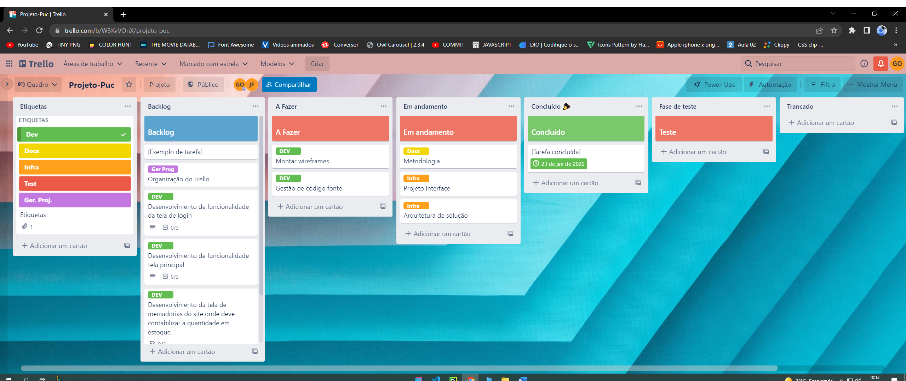
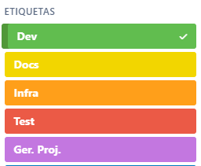

# Metodologia

## Relação de Ambientes de Trabalho
Os artefatos do projeto são desenvolvidos a partir de diversas plataformas e a relação dos ambientes com seu respectivo propósito é apresentada na tabela que se segue. 

| Ambiente                          | Plataforma | Link de acesso                                                                                                          |
| --------------------------------- | ---------- | ----------------------------------------------------------------------------------------------------------------------- |
| Repositório de código fonte       | Github     | https://github.com/ICEI-PUC-Minas-PMV-ADS/pmv-ads-2022-1-e1-proj-web-t7-grupo_5_projeto_controle_estoque                |
| Documentos do projeto             | Github     | https://github.com/ICEI-PUC-Minas-PMV-ADS/pmv-ads-2022-1-e1-proj-web-t7-grupo_5_projeto_controle_estoque/tree/main/docs |
| Projeto de Interface e Wireframes | MarvelApp  | https://marvelapp.com/4hd6091                                                                                           |
| Gerenciamento do Projeto          | Trello     | https://trello.com/b/W3KvVOnX/projeto-puc                                                                               |

## Gestão de código fonte
Para gestão do código fonte do software desenvolvido pela equipe, o grupo utiliza um processo baseado no WorkFlow, mostrado na Figura a seguir. Desta forma, todas as alterações no código são realizadas em branches, onde os desenvolvedores devem criar um branch para cada funcionalidade nova no projeto.

###### Figura X - Fluxo de controle do código fonte no repositório git

## Gerenciamento de Projeto

A equipe utiliza metodologias ágeis, tendo escolhido o Scrum como base para definição do processo de desenvolvimento.
A equipe está organizada da seguinte maneira:
-	Scrum Master: Gustavo Alves
-	Product Owner: Alvaro
-	Equipe de Desenvolvimento
	-    Jefferson Filho
	-    José Carlos
	-    Nelita Moreira
	-    Marcos Vinícius
-	Equipe de Design
    -	Leonardo Guilherme

Para organização e distribuição das tarefas do projeto, a equipe está utilizando o Trello estruturado com as seguintes listas: 
-	Backlog: recebe as tarefas a serem trabalhadas e representa o Product Backlog. Todas as atividades identificadas no decorrer do projeto também devem ser incorporadas a esta lista.

-	A Fazer: Esta lista representa o Sprint Backlog. Este é o Sprint atual que estamos trabalhando.

-	Em andamento: Quando uma tarefa tiver sido iniciada, ela é movida para cá.

-	Teste: Checagem de Qualidade. Quando as tarefas são concluídas. No final da semana, eu revejo essa lista para garantir que tudo saiu perfeito.

-	Concluído: nesta lista são colocadas as tarefas que passaram pelos testes e controle de qualidade e estão prontos para ser entregues ao usuário.

-	Trancado: Quando alguma coisa impede a conclusão da tarefa, ela é movida para esta lista juntamente com um comentário sobre o que está travando a tarefa.

O quadro kanban do grupo no Trello está disponível através da URL https://trello.com/b/W3KvVOnX/projeto-puc e é apresentado, no estado atual, na Figura 2.

###### Figura 2 - Tela do kanban utilizada pelo grupo

As tarefas são, ainda, etiquetadas em função da natureza da atividade e seguem o seguinte esquema de cores/categorias:
-	Desenvolvimento 
-	Documentação                                 
-	Infraestrutura
-	Testes
-	Gerência de Projetos.

