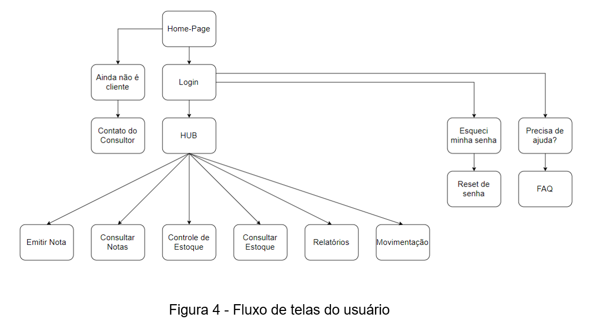
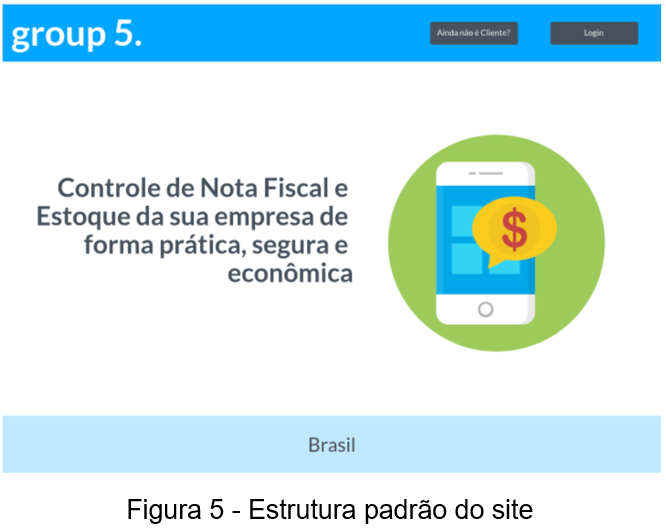
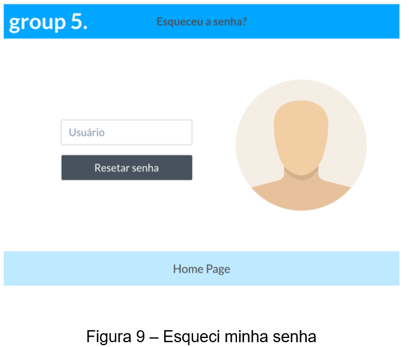
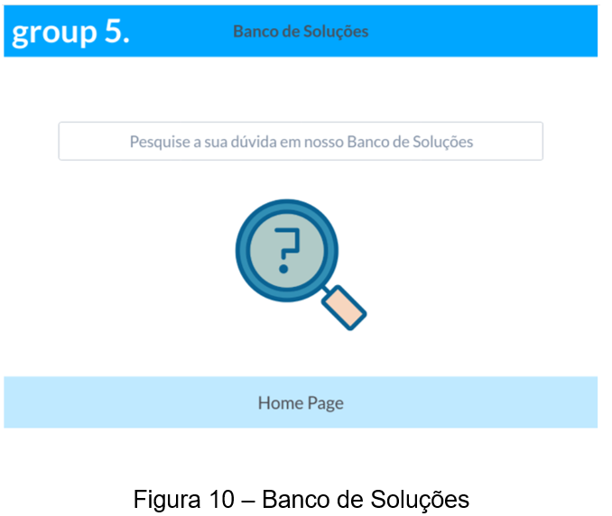
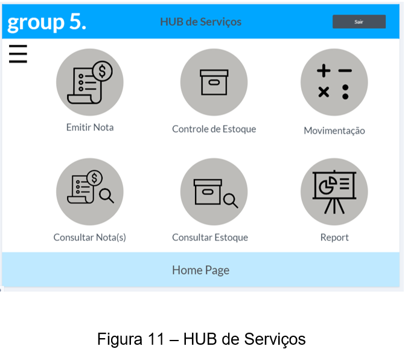

# Projeto de Interface

Dentre as preocupações para a montagem da interface do sistema, focamos em questões como agilidade, acessibilidade e usabilidade. Dessa forma, o projeto tem uma identidade visual padronizada em todas as telas que são projetadas para funcionamento em desktops e dispositivos móveis.

## User Flow

O diagrama apresentado na Figura 4 abaixo mostra o fluxo de interação do usuário pelas telas do sistema. Cada uma das telas deste fluxo é detalhada na seção de wireframes a seguir. Para visualizar o wireframe interativo, acesse o  <a href="https://marvelapp.com/prototype/7g30c2j" target="_blank">Website Group 5.</a>

---
## Wireframes

Conforme fluxo de telas do projeto, apresentado no item anterior, as telas do sistema são apresentadas em detalhes nos itens que se seguem. As telas do sistema apresentam uma estrutura comum que é apresentada na Figura X. Nesta estrutura, existem 3 grandes blocos, descritos a seguir. São eles:
-	Cabeçalho - local onde são dispostos elementos fixos de identidade (logo) e navegação principal do site (menu da aplicação);

-	Conteúdo - apresenta o conteúdo da tela em questão;

---
<!-- imagens wireframes -->

---
### Tela - Home-Page

A tela de home-page mostra uma breve mensagem de apresentação.
-	Componente de <b>Ainda não é Cliente</b> que permite o abrir uma página de preenchimento do usuário para um formulário para preenchimento de dados de contato;

-	Componente de <b>Login</b> que leva o usuário para a tela se o mesmo for cliente.

---
### Tela - Login

A tela de Login apresenta os componentes clássicos para esse tipo de tela. 

---
### Tela – Ainda não é cliente

A tela permite o usuário informar os dados para que a empresa entre em contato com o mesmo.

---
### Tela – Esqueci minha senha

A tela permite ao usuário informar o e-mail para receber um link de reset de senha. 

---
### Tela – Banco de Soluções

A tela permite ao usuário que faça busca no Banco de Soluções da empresa.

---
### Tela – HUB de Serviços

A tela apresenta os principais serviços disponíveis para o usuário, sendo possível exibir todos utilizando o menu lateral oculto. 

---
### Tela – Página em Construção

A tela padrão apresenta os componentes ainda em construção. 

---