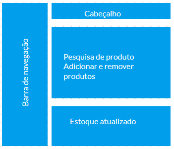
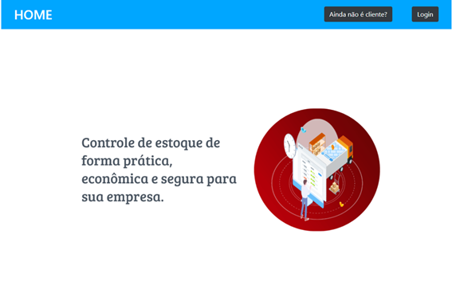
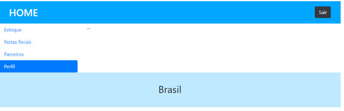

# Template padrão do site

## Template do Site
O padrão de layout a ser utilizado pelo site tem correspondência ao projeto de interface elaborado anteriormente, conforme Figura 13.

###### Figura 13 – Layout do site
 

O template criado está disponível no site https://gurudevop7884.github.io/Projeto-Puc-Bootstrap/homepage.html e é composto pelos seguintes layouts: 

-	Tela principal
-	Estoque
-	Notas fiscais
-	Parceiros
-	Perfil

A responsividade do site é realizada por meio do Bootstrap – principalmente media queries.

---

### Tela principal

Nessa tela, o usuário vai ter acesso a notícias sobre a empresa, que são dadas por um carrossel feito por meio do Bootstrap, assim como é possível clicar no botão de Login, que redireciona o usuário para a tela de Login. 

###### Figura 14

---

### Login

Nessa tela, o usuário pode fazer seu login e, posteriormente, ter acesso às funcionalidades descritas a seguir.

###### Figura 15

---

### Estoque

Nessa tela, o usuário poderá adicionar ou remover itens do estoque (já realizado e disponível), além de pesquisar por um produto específico que já consta no estoque. Os itens são adicionados e atualizados de acordo com o dia e a hora. Além disso, o usuário também pode baixar uma tabela em formato xlsx com o estoque atualizado. 

###### Figura 16

---

### Notas fiscais

Nesta tela, o usuário pode emitir notas fiscais de produtos recém vendidos. Isso ainda está em fase de implementação. 

###### Figura 17

---

### Parceiros

Nessa tela, são mostrados os parceiros da empresa.

###### Figura 18

---

### Perfil

Nessa tela, é mostrado o perfil do usuário logado. Isso ainda está em fase de implementação. 

###### Figura 19

---

## Referências

Vietro, I. L. Fluxo de desenvolvimento com GitFlow. 2015. 

Disponível em: https://imasters.com.br/agile/fluxo-de-desenvolvimento-com-gitflow. Acessado em 22/04/2022.
