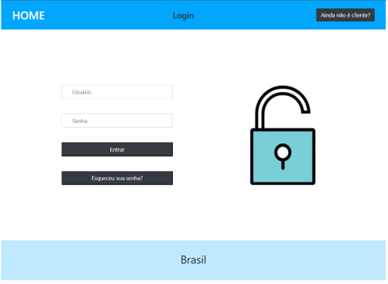
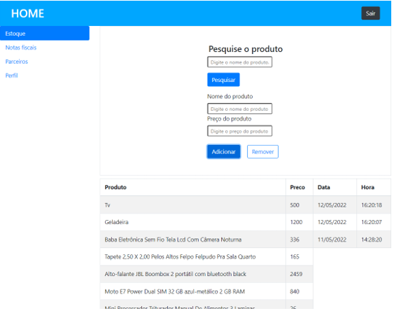
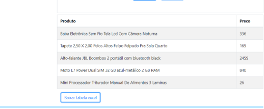

# Programação de Funcionalidades

##	Funcionalidades do Sistema (Telas)

Nesta seção são apresentadas as telas desenvolvidas para cada uma das funcionalidades do sistema. O respectivo endereço (URL) e outras orientações de acesso são apresentadas na sequência.

### Tela de login

###### Mercadorias e tela de login (RF-01 e RF-02)

###### Figura 20
 

### Tela de Estoque

###### Figura 21
 

<b>Requisitos atendidos</b>
-	RF-01 
-	RF-02 -

<b>Artefatos da funcionalidade</b>
-	homepage.html
-	homepage.js
-	homepage.css

<b>Instruções de acesso</b>
1.	Abra um navegador de Internet e informe os seguintes URLs: 
2.	Login: https://gurudevop7884.github.io/Projeto-Puc-Bootstrap/login.html
3.	Estoque:https://gurudevop7884.github.io/Projeto-Puc-Bootstrap/homepage.html

---

###### Registro entrada de estoque (RF-03)

###### Figura 22
 
<b>Requisitos atendidos</b>
-	RF-03 

<b>Artefatos da funcionalidade</b>
-	homepage.html
-	homepage.js
-	homepage.css

<b>Instruções de acesso</b>

Abra um navegador de Internet e informe o seguinte URL
1.	https://gurudevop7884.github.io/Projeto-Puc-Bootstrap/homepage.html

---

###### Pesquisa de produtos (RF-05)

###### Figura 23
 

<b>Artefatos da funcionalidade</b>
-	homepage.html
-	homepage.js
-	homepage.css

<b>Instruções de acesso</b>

Abra um navegador de Internet e informe o seguinte URL
1.	https://gurudevop7884.github.io/Projeto-Puc-Bootstrap/homepage.html

---
###### Informações de clientes (RF-06)

###### Figura 24
 

<b>Artefatos da funcionalidade</b>
-	homepage.html
-	homepage.js
-	homepage.css

<b>Instruções de acesso</b>

Abra um navegador de Internet e informe o seguinte URL
1.	https://gurudevop7884.github.io/Projeto-Puc-Bootstrap/homepage.html

---

###### Planilha de produtos - Excel (RF-08)

###### Figura 25
 

<b>Artefatos da funcionalidade</b>
-	homepage.js

<b>Instruções de acesso</b>

Abra um navegador de Internet e informe o seguinte URL
1.	https://gurudevop7884.github.io/Projeto-Puc-Bootstrap/homepage.html

2. Clique em baixar tabela Excel.

---

## Referências

Vietro, I. L. Fluxo de desenvolvimento com GitFlow. 2015. 

Disponível em: https://imasters.com.br/agile/fluxo-de-desenvolvimento-com-gitflow. Acessado em 22/04/2022.
