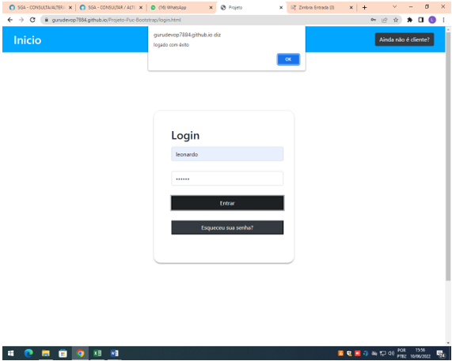
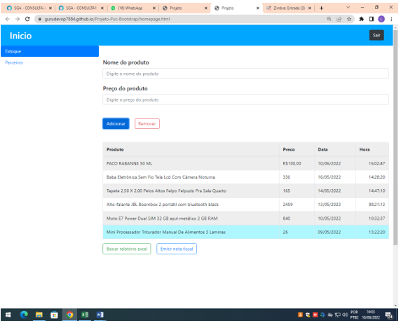
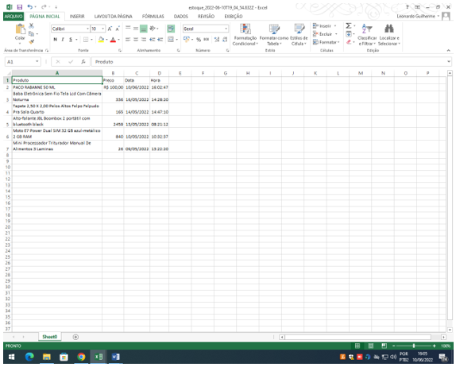
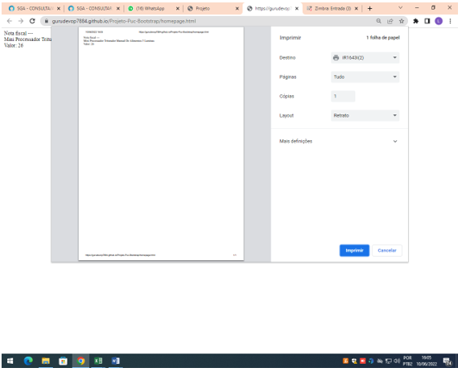
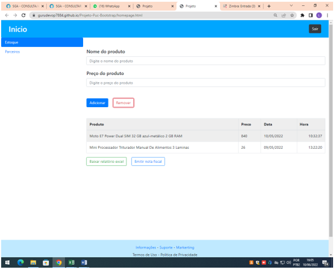
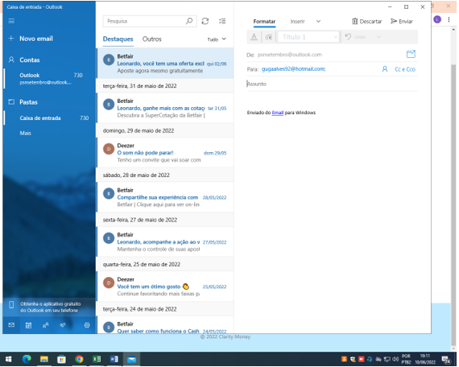

# Registro de Testes de Software

## CT-01: Login

---
## CT-02: Parceiros

---
## CT-03: Cadastro de um novo produto

---
## CT-04: Baixar relatório em xlsx (Excel)

---
## CT-05: Emitir Nota Fiscal

---
## CT-06: Remover um produto

---
## CT-07: Solicitar Apoio do Suporte
