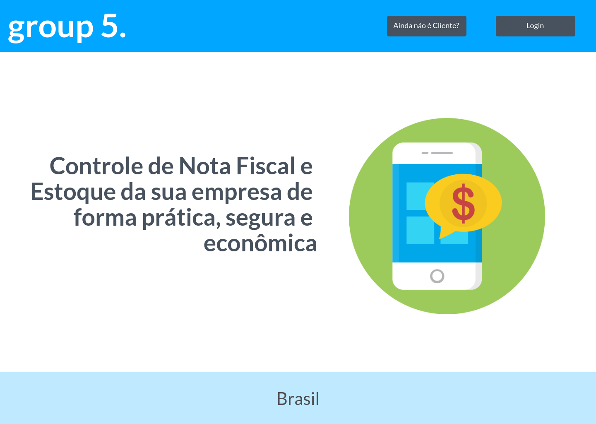
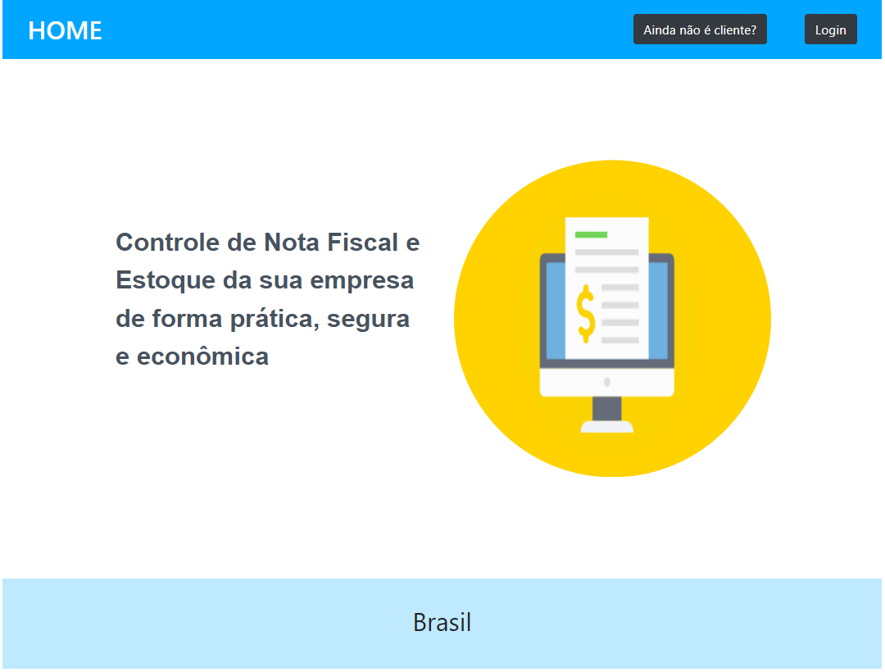
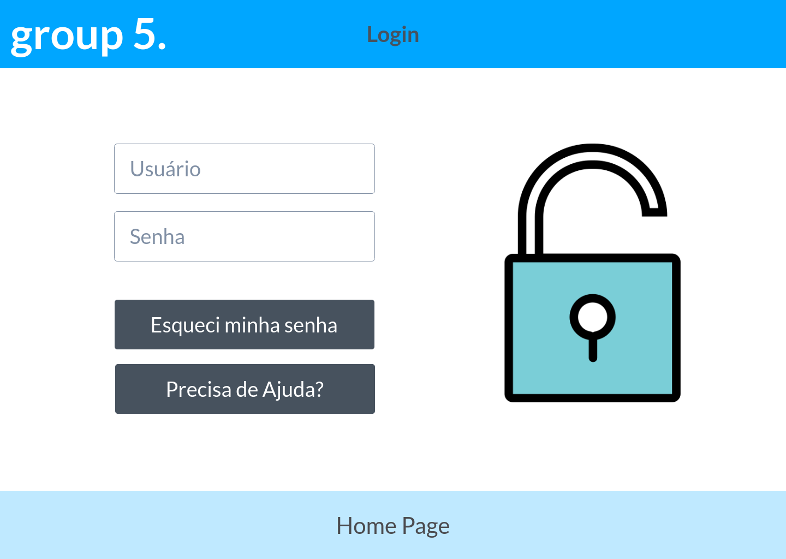
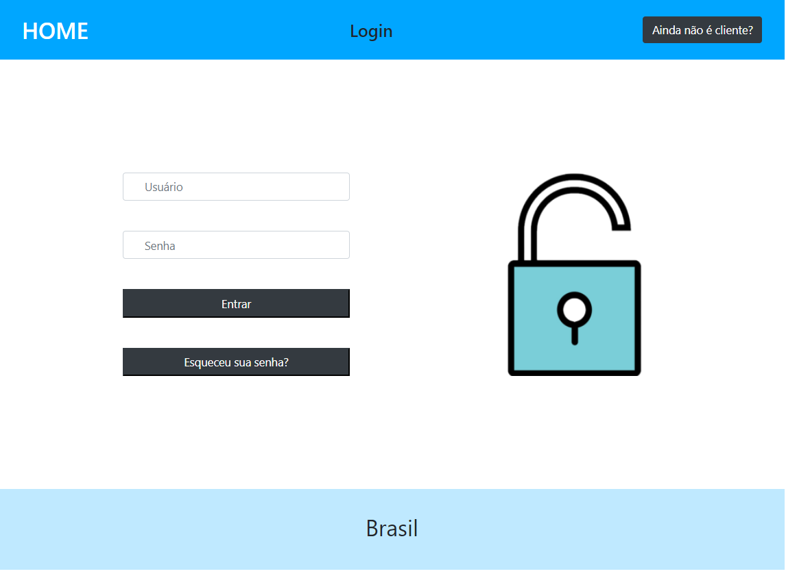

# Projeto-interface-Puc
#### Projeto da faculdade
### Ferramentas :
- Bootstrap
- HTML5
- CSS3

## Interface de referência para criação:

## Referêcia-1

---

## Resultado-1

---
## Referêcia-2

## Resultado-2

