# Instruções de utilização

## Instalação do Site

O site em HTML/CSS/JS é um projeto estático, logo pode ser utilizado tanto em servidores...

## Histórico de versões

### [0.1.0] - 27/04/2022
#### Adicionado
- ## Página inicial do site
  
  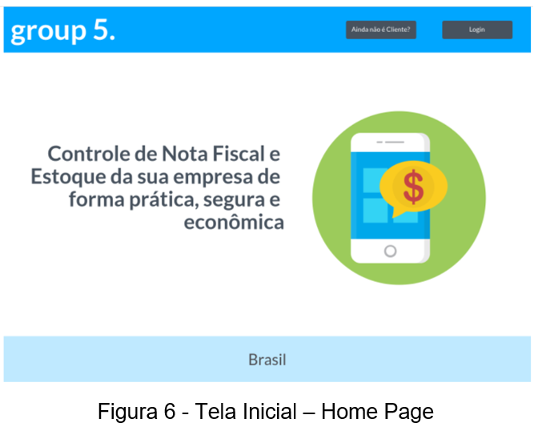

- ## Página de login
  
  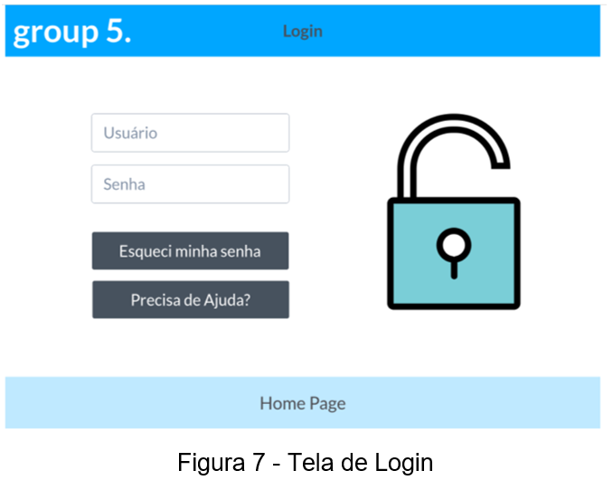

- ## Página de cadastro
  
  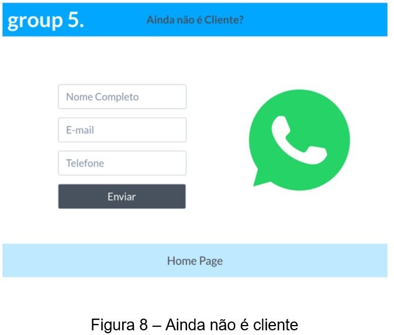

### [0.1.1] - 14/05/2022
#### Adicionado
- ## Pagina de estoque
  
  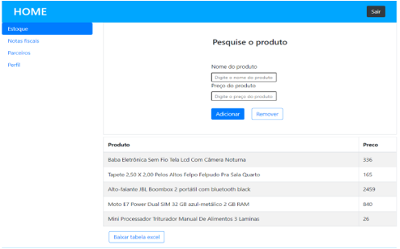

- ## Barra de pesquisa
  
  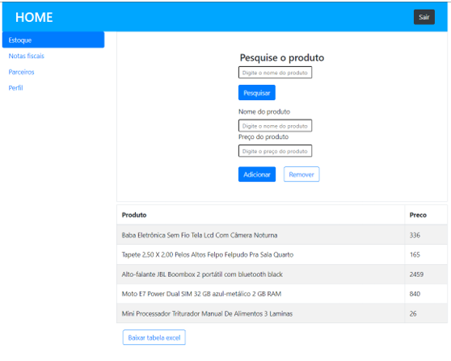

- ## Perfil
  
  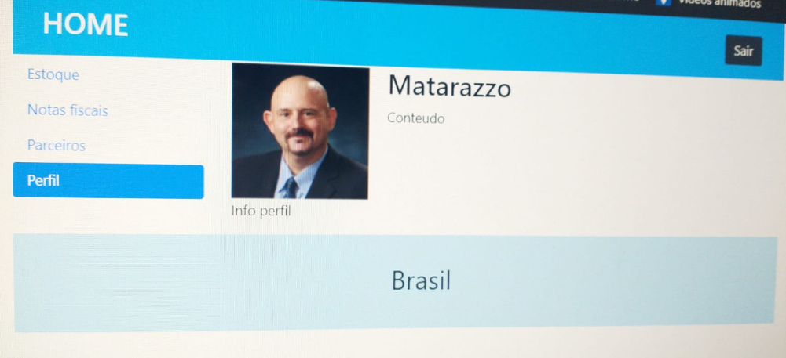
  
- ## Parceiros

  

### [0.2.0] - 24/05/2022
#### Adicionado
- ## Mudança na interface geral abordando um modelo full screen
  
  

  ---

- ## Adicionado um carousel na tela inicial
  
     
---
- ## Alteração em todas as telas com formulários (Login, Recuperação de senha, Estoque)

   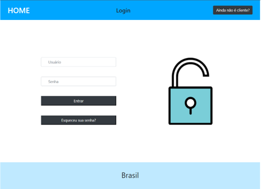

   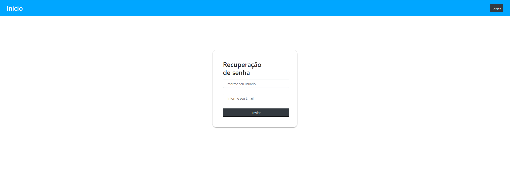
   
   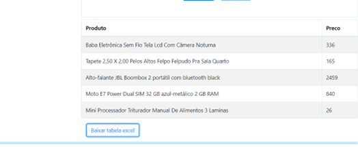

---

- ## Remoção do formulario de pesquisa

   

---

- ## Remoção da aba Perfil e Notas fiscais

   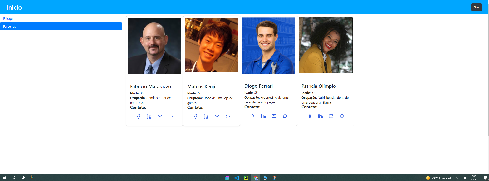

---

### [0.2.1] - 31/05/2022
#### Adicionado

- ## Adicionado funcionalidade de emissão de nota fiscal e data/hora no estoque

  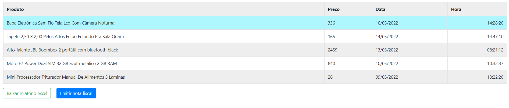

### [0.2.2] - 09/06/2022
#### Adicionado

- ## Responsividade em todo o site

  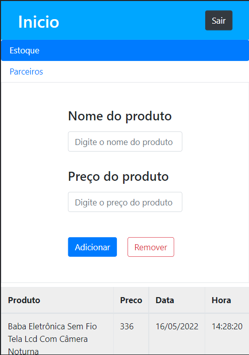
  